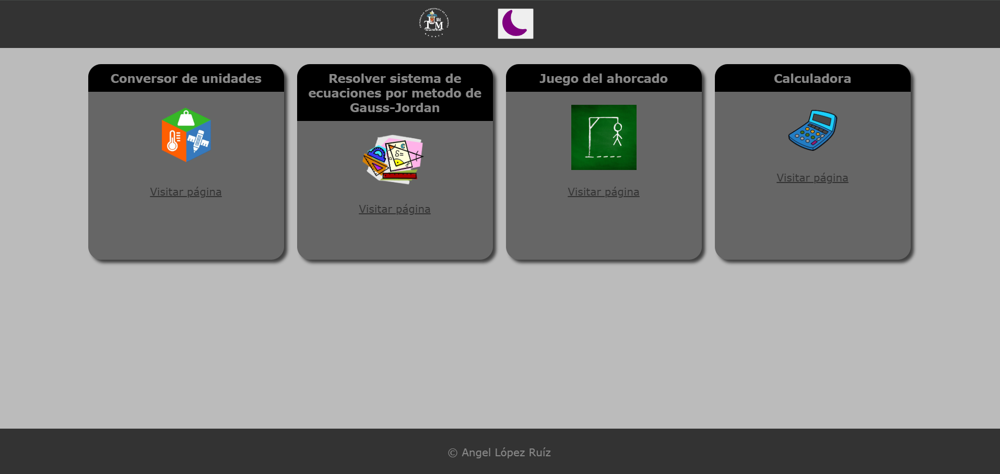
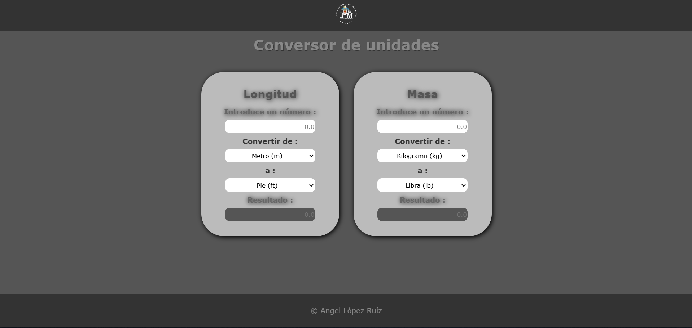
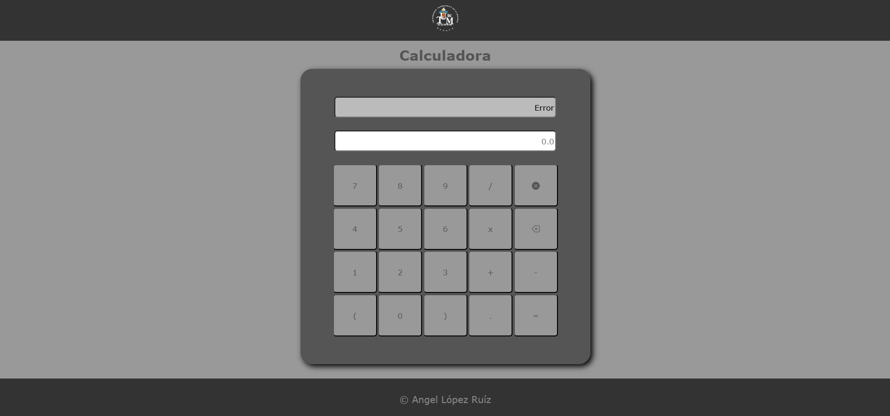
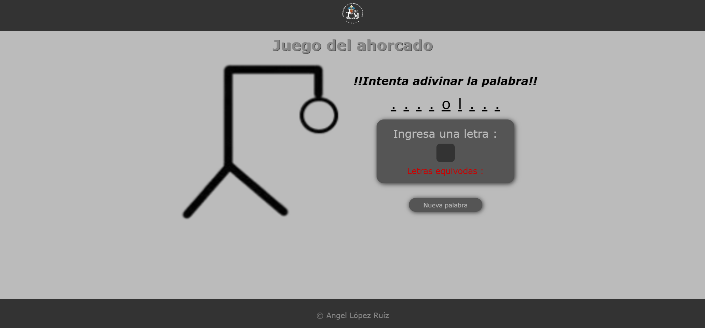
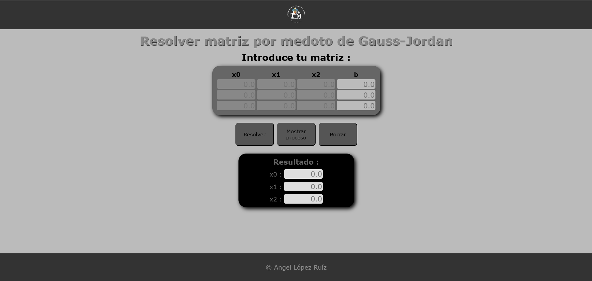

# proyectos
# Proyecto Web

## Resumen

Este proyecto es una aplicación web que organiza múltiples herramientas interactivas en una estructura sencilla y accesible. La página principal funciona como un hub para acceder a cuatro funcionalidades principales: un resolvedor de matrices mediante el método Gauss-Jordan, un juego del ahorcado, una calculadora y un conversor de unidades. Además, incluye un botón para cambiar entre tema claro y oscuro, ofreciendo una experiencia personalizada. Cada herramienta cuenta con características únicas: la calculadora guarda la última operación realizada en localStorage, el juego del ahorcado utiliza un conjunto predefinido de palabras, y el conversor permite conversiones de unidades de longitud y masa.

## Tecnologías usadas

El proyecto está desarrollado utilizando HTML, CSS y JavaScript. HTML estructura las páginas y sus elementos, CSS define el diseño visual y la capacidad de alternar entre temas claro y oscuro, y JavaScript proporciona la funcionalidad interactiva necesaria para las herramientas, como cálculos dinámicos, almacenamiento en localStorage y manejo de eventos del usuario. Estas tecnologías fueron elegidas por su facilidad de integración y capacidad para construir una aplicación web funcional y responsiva.


## Algunas capturas de los proyectos utilizando el modo oscuro, y partes del código de javaScript

### Página principal


```javascript
const isDarkMode = localStorage.getItem("theme") === "dark";

// Aplica el tema almacenado
if (isDarkMode) {
    document.body.classList.add("dark-mode");
    themeIcon.src = "assets/moon-fill.svg"; // Imagen de la luna
    themeIcon.alt = "modo-oscuro";
} else {
    themeIcon.src = "assets/sun.svg"; // Imagen del sol
    themeIcon.alt = "modo-claro";
}

```

### Conversor de unidades

```javascript
const conversiones = {
    1: 1000,  // km a metros
    2: 1,     // metro a metros
    3: 0.1,   // dm a metros
    4: 0.01,  // cm a metros
    5: 0.001, // mm a metros
    6: 0.0254, // pulgada a metros
    7: 0.3048, // pie a metros
    8: 0.9144, // yarda a metros
    9: 1609.34 // milla a metros
};

// Escucha eventos para convertir valores de longitud
d.addEventListener("keyup", (e) => {
    if (e.target.matches(inputEntrada)) {
        let valorEntrada = parseFloat(e.target.value);
        let valorSalida = d.querySelector(`${inputSalida}`);
        // Obtiene las unidades seleccionadas y realiza la conversión
        let unidEntradaEscogida = document.querySelector(unidEntrada).value;
        let unidSalidaEscogida = document.querySelector(unidSalida).value;
        // Conversión y resultado
        const valorEnMetros = valorEntrada * conversiones[unidEntradaEscogida];
        const resultado = (valorEnMetros / conversiones[unidSalidaEscogida]).toFixed(4);
        valorSalida.value = resultado;
    } else {
        valorSalida.value = "";
    }
});
```

### Calculadora


```javascript
function resolverExpresion(expresion) {
    expresion = expresion.replace(/x/g, '*'); // Reemplaza 'x' por '*'
    
    const infijaAPosfija = (expresion) => {
        const precedencia = { '+': 1, '-': 1, '*': 2, '/': 2 };
        const operadores = Object.keys(precedencia);
        const salida = [];
        const pila = [];
        const tokens = expresion.match(/(\d+(\.\d+)?|[+*/()-])/g);

        for (let i = 0; i < tokens.length; i++) {
            let token = tokens[i];
            if (token === '-' && (i === 0 || tokens[i - 1] === '(' || operadores.includes(tokens[i - 1]))) {
                token += tokens[++i]; // Maneja el signo negativo
            }

            if (!isNaN(parseFloat(token))) {
                salida.push(token); // Si es un número, lo agrega a la salida
            } else if (operadores.includes(token)) {
                while (pila.length && operadores.includes(pila[pila.length - 1]) && precedencia[token] <= precedencia[pila[pila.length - 1]]) {
                    salida.push(pila.pop());
                }
                pila.push(token);
            } else if (token === '(') {
                pila.push(token);
            } else if (token === ')') {
                while (pila.length && pila[pila.length - 1] !== '(') {
                    salida.push(pila.pop());
                }
                pila.pop(); // Elimina '('
            }
        }

        while (pila.length) salida.push(pila.pop()); // Vacía la pila

        return salida;
    };

    const evaluarPosfija = (posfija) => {
        const pila = [];
        for (let token of posfija) {
            if (!isNaN(parseFloat(token))) {
                pila.push(parseFloat(token)); // Si es un número, lo agrega a la pila
            } else {
                const b = pila.pop();
                const a = pila.pop();
                switch (token) {
                    case '+': pila.push(a + b); break;
                    case '-': pila.push(a - b); break;
                    case '*': pila.push(a * b); break;
                    case '/': pila.push(a / b); break;
                }
            }
        }
        return pila.pop(); // El resultado final está en la cima de la pila
    };

    const posfija = infijaAPosfija(expresion);
    return evaluarPosfija(posfija);
}

```

### Juego del Ahorcado


```javascript
function adivinarPalabra(idInput, arrLetrasOcultas, idParrafoLetrasEquivocadas, arrPalabraCompleta) {
    const containerDibujo = document.querySelector(".container-dibujo");
    const imagen = containerDibujo.querySelector("img");
    let contador = 1;

    d.addEventListener("keyup", (e) => {
        if (e.target.matches(idInput) && contador !== 6 && arrLetrasOcultas.length !== 0) {
            let input = d.querySelector(idInput);
            let letraIngresada = input.value;
            let parrafoLetrasEquivocadas = d.querySelector(idParrafoLetrasEquivocadas);
            let containerPalabra = d.querySelector(".container-palabra");
            let pElements = containerPalabra.querySelectorAll("p");

            if (arrLetrasOcultas.includes(letraIngresada)) {
                let indexToReveal = -1;
                for (let i = 0; i < arrPalabraCompleta.length; i++) {
                    if (arrPalabraCompleta[i] === letraIngresada && pElements[i].textContent === ".") {
                        indexToReveal = i;
                        break;
                    }
                }
                if (indexToReveal !== -1) {
                    pElements[indexToReveal].textContent = letraIngresada;
                    arrLetrasOcultas.splice(arrLetrasOcultas.indexOf(letraIngresada), 1);
                }
            } else {
                contador++;
                imagen.classList.add("blink");
                setTimeout(() => {
                    imagen.classList.remove("blink");
                    imagen.src = `assets/ahorcado-${contador}.png`;
                }, 900);

                let nuevaLetra = d.createElement("span");
                nuevaLetra.textContent = letraIngresada + " ";
                parrafoLetrasEquivocadas.appendChild(nuevaLetra);
            }

            input.value = "";
            if (contador === 6 || arrLetrasOcultas.length === 0) {
                input.readOnly = true;
                const containerMsjFinal = document.querySelector(".container-msj-final");
                const p = d.createElement("p");
                p.textContent = arrLetrasOcultas.length === 0 ? "¡¡Felicidades adivinaste la palabra!!" : "¡¡Oh vaya perdiste, vuelve a intentarlo!!";
                p.classList.add(arrLetrasOcultas.length === 0 ? "parrafo-victoria" : "parrafo-derrota");
                containerMsjFinal.appendChild(p);
            }
        }
    });
}
```

### Resolvedor de ecuaciones lineales (Gauss-Jordan)


```javascript
function gaussJordanProceso(matriz, claseDivContainer) {
    const n = matriz.length;
    const contenedor = document.querySelector(claseDivContainer);
    contenedor.innerHTML = ""; // Limpiar contenido previo

    for (let i = 0; i < n; i++) {
        if (matriz[i][i] === 0) {
            console.error("Error: El elemento diagonal es cero, no se puede dividir.");
            return null;
        }

        // Hacer el elemento matriz[i][i] = 1
        let divisor = matriz[i][i];
        for (let j = 0; j <= n; j++) {
            matriz[i][j] /= divisor;
        }

        const contenedorPaso = document.createElement("div");
        contenedorPaso.classList.add("container-paso");
        contenedorPaso.innerHTML += `Dividir fila ${i + 1} entre ${divisor.toFixed(2)}:<br>`;
        contenedorPaso.innerHTML += crearTabla(matriz).outerHTML;
        contenedor.appendChild(contenedorPaso);

        // Hacer los elementos en la columna i iguales a 0, excepto en matriz[i][i]
        for (let k = 0; k < n; k++) {
            if (k !== i) {
                let factor = matriz[k][i];
                for (let j = 0; j <= n; j++) {
                    matriz[k][j] -= factor * matriz[i][j];
                }

                const contenedorPaso2 = document.createElement("div");
                contenedorPaso2.classList.add("container-paso");
                contenedorPaso2.innerHTML += `Restar ${factor.toFixed(2)} veces la fila ${i + 1} de la fila ${k + 1}:<br>`;
                contenedorPaso2.innerHTML += crearTabla(matriz).outerHTML;
                contenedor.appendChild(contenedorPaso2);
            }
        }
    }

    // Obtener los resultados de la última columna de la matriz
    let resultado = matriz.map(fila => fila[n]);

    // Crear un contenedor final para mostrar el resultado
    const contenedorResultado = document.createElement("div");
    contenedorResultado.classList.add("container-paso");
    contenedorResultado.innerHTML += `Resultado final:<br>`;
    contenedorResultado.innerHTML += crearTabla([resultado]).outerHTML;
    contenedor.appendChild(contenedorResultado);

    // Asignar resultados si gaussJordan retorna un valor válido
    const resultadoInputs = ["#resultado-uno", "#resultado-dos", "#resultado-tres"];
    resultado.forEach((valor, index) => {
        if (document.querySelector(resultadoInputs[index])) {
            document.querySelector(resultadoInputs[index]).value = valor.toFixed(4);
        }
    });
}
```